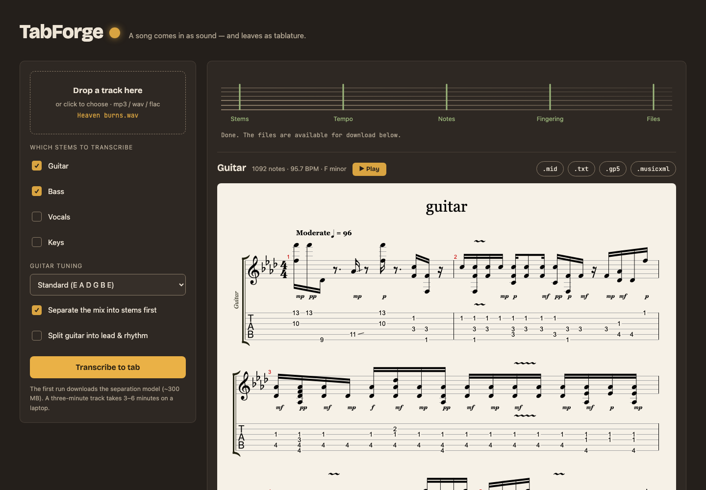
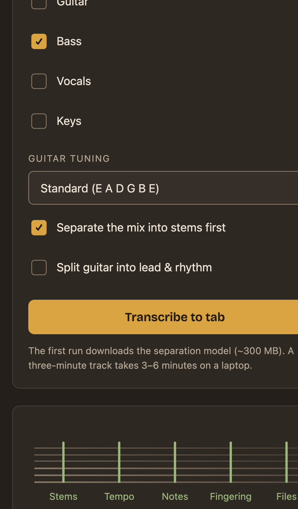
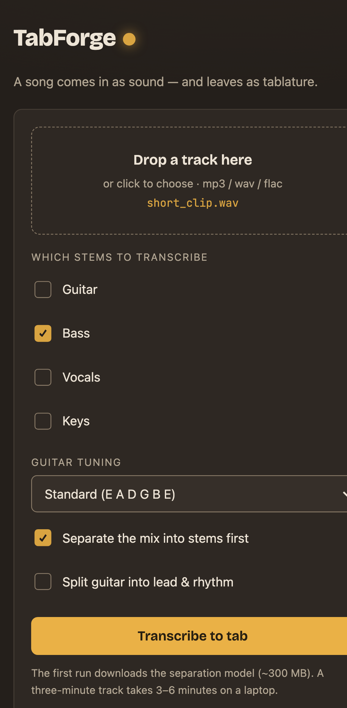
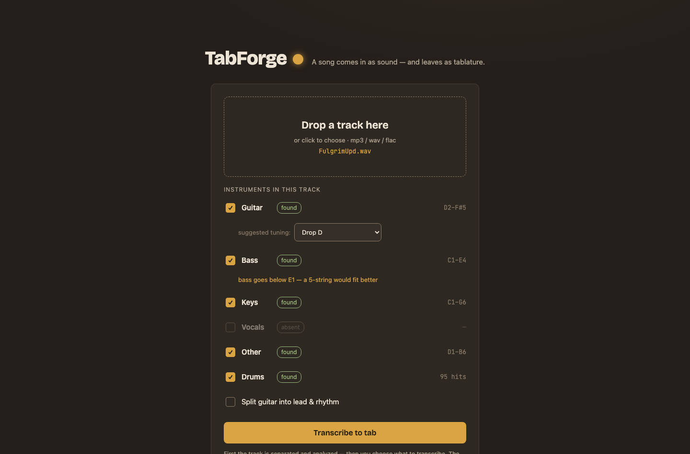

# TabForge

Audio (including tracks from Suno) → tablature and sheet music.
One codebase — three platforms: laptop, browser, mobile.

## Quick start

```bash
docker compose up -d --build      # 1. build & start
open http://localhost:8000        # 2. open the app
#                                   3. drop a track — it gets analyzed,
#                                      you pick the instruments, and the
#                                      project opens as a playable score
```



No Docker? Grab **TabForge.app** from the
[latest release](https://github.com/rayBastard/tabforge/releases/latest)
(macOS; first launch: right-click → Open), or run from source — see
Installation below.

## How it works

The app is a local server (FastAPI) + a web UI.
On a laptop the UI opens in a native window (pywebview), in a browser —
at the server's address, on a phone — as a PWA. The logic is never rewritten.

```
┌─────────────────────────── frontend/ ────────────────────────────┐
│  the same HTML/JS: window on a laptop, browser tab, phone screen  │
└──────────────────────────────┬───────────────────────────────────┘
                        HTTP (localhost or network)
┌──────────────────────────────┴───────────────────────────────────┐
│ server/   FastAPI: jobs, progress, file delivery                  │
│ pipeline  Demucs → Basic Pitch → librosa → fretboard → export     │
│ core/     fingering (Viterbi over hand positions) — core, 0 deps  │
└──────────────────────────────────────────────────────────────────┘
```

## Roadmap

### Phase 0 — repository skeleton ✅ (done)
- [x] `src/`, `frontend/`, `tests/` structure
- [x] `pyproject.toml` with extras: the core installs without ML dependencies
- [x] CI on GitHub Actions (Python 3.10–3.12)
- [x] MIT license, .gitignore

### Phase 1 — core ✅ (done)
- [x] `core/fretboard.py`: note → string+fret. Viterbi with a
      "fingering + hand position" state. Verified: the C major scale lands
      in first position, Em/G/C/D chords in open shapes,
      solos in a compact box
- [x] `core/quantize.py`: snapping to the beat grid, note durations
- [x] tunings: standard, drop D, E♭, DADGAD, open G, 4/5-string bass, ukulele

### Phase 2 — audio pipeline ✅ (done)
- [x] `audio/transcribe.py`: Demucs (stems) + Basic Pitch (notes) + librosa (tempo)
- [x] `pipeline.py`: a single entry point for CLI/server/desktop
- [x] run it on real Suno tracks
- [x] tune Basic Pitch thresholds for the character of Suno tracks
- [x] ghost-overtone cleanup (minimum note length + polyphony cap;
      the heuristic could still be smarter)
- [x] stable tempo: detected once per track (drums stem with an
      audibility check, falling back to the mix), tempo-multiple
      disambiguation, sanity guard with a 120 BPM fallback
- [x] optional lead/rhythm guitar split (`--split-guitars`)

### Phase 3 — export ✅ (done)
- [x] MIDI, ASCII tab
- [x] .gp5 (PyGuitarPro) — verified via alphaTab rendering and a
      round-trip check (`scripts/check_gp5.py`: pitches, positions,
      key signatures, effects)
- [x] MusicXML (music21) for MuseScore
- [x] key signatures (Krumhansl-Schmuckler key detection)
- [x] techniques: hammer-on/pull-off, slides, bends and vibrato from
      pitch-bend data — in gp5 effects and the ASCII tab (5h7, /, ~)
- [x] time signature (n/4) and grid subdivision (including triplets)
      written through to the gp5

### Phase 4 — laptop app ✅ (done)
- [x] server: POST /api/jobs, progress, file download
- [x] UI: upload, "fretboard-style" progress, ASCII tab,
      notes+tabs rendering via alphaTab from .gp5, per-part Play
      button (lazy-loaded synth)
- [x] `desktop.py`: native window (pywebview)
- [x] verified end-to-end (browser-driven tests with screenshots)
- [x] app bundle build: `pyinstaller TabForge.spec` → `dist/TabForge.app`
      (see the Building section; Demucs models download on first run
      into `~/.cache`)

### Phase 5 — browser ✅ (done for the current scale)
- [x] production hardening: job TTL + cleanup, upload/duration limits,
      audio validation, optional API token, configurable workers
- [x] Docker image + compose (model cache in a volume) — see Deployment
- [x] first real deployment: Cloudflare quick tunnel over the container,
      verified from a phone on mobile data

Remaining tails live as issues: a job queue is deferred until real
multi-user load (#6), permanent GPU hosting with a stable domain (#7).

### Phase 6 — mobile ✅ (done)
- [x] PWA: manifest (standalone, dark theme, lamp icons) + a
      version-keyed service worker — the shell starts instantly from
      cache and old shells are purged on deploy; /api/* always live
- [x] mobile UI pass: 44px+ touch targets, tap on the drop zone opens
      the file picker, the ASCII tab scrolls inside its own container
- [x] the "everything on the server, the phone is just a client" option
      works right away (see Cloudflare Tunnel in Deployment)

The mobile UI (iPhone / Android viewports):

<p>
  
  
</p>

To install on a phone: open the (tunnel) URL — Android/Chrome offers
"Install app", on iOS/Safari use Share → "Add to Home Screen". The app
opens standalone with the lamp icon.

Remaining tail as an issue: vendoring alphaTab + the soundfont for a
fully offline PWA (#8).

### Phase 7 — the project player ✅ (done)
- [x] two-step flow: the track is separated and **analyzed** first —
      each instrument card shows whether it sounds at all
      (found / quiet / absent), its note range, and a suggested tuning
      (a D2 low note suggests drop D; a bass below E1 hints at a
      5-string) — then only the instruments you pick are transcribed,
      from the cached stems; changing the selection never re-runs demucs
- [x] instrument profiles: keys and vocals are notation-only (no bends,
      slides, or hammer-ons — legato becomes a slur), every track plays
      with its own MIDI program, rolled piano chords are gathered back
      into real chords
- [x] tick-based gp5 export: note positions ride the detected beat
      grid, so a Suno track whose tempo breathes no longer drifts into
      wrong measures
- [x] backing track mixed from the stems you did NOT pick — practice
      over the rest of the band
- [x] the project screen: transport bar, track list with per-track
      **mute/solo**, and ONE multi-track score (a single alphaTab
      instance with a playback cursor) instead of per-stem fragments
- [x] the note editor: click any note, pick the string/fret it should
      live on — the fingering search re-arranges the surrounding notes
      around your pin; one-step undo
- [x] drum track: percussion is transcribed by onsets + spectral kit
      classification (kick / snare / hi-hat / tom / crash), rendered as
      a percussion staff (GM channel 10) in the project score, with a
      K/S/H ASCII grid and its own .gp5/.mid downloads



### Phase 8 — hands-on polish ✅ (done)
- [x] musicality: real durations written as TIED notes across beats and
      barlines, small gaps absorbed instead of chopped into rests,
      letRing on keys — long notes are held, not truncated
- [x] steady rhythm: the beat grid repairs tracker glitches (skipped /
      phantom beats) and smooths jitter while still following the
      track's real tempo drift; rhythm precision (eighths / triplets /
      sixteenths) is the user's choice at the transcribe step
- [x] playback you can follow: amber current-bar highlight, a beat
      cursor, "bar N / M" in the transport, Space = play/pause
- [x] per-instrument tabs over the score (everything still sounds;
      mute/solo rule the mix)
- [x] virtual instruments under the score: a 22-fret fretboard, a
      keyboard, drum pads — current notes light up during playback,
      and the fretboard doubles as the note editor (click a score
      note, pick its new position right on the neck)
- [x] a Stop button that actually kills a running separation, an
      in-app backing-track player, a 200 MB default upload limit, and
      a short what-this-does intro on the start screen

## Installation (development)

```bash
git clone https://github.com/<your-username>/tabforge && cd tabforge
python -m venv .venv && source .venv/bin/activate   # Windows: .venv\Scripts\activate
pip install -e ".[all]"
```

### Optional whole-mix models (better notes, separate installs)

Two external models can take over transcription for specific
instruments. Both are optional: without them TabForge falls back to
its built-in per-stem transcription.

**MuScriptor** (guitar + bass; the biggest accuracy win on our stand —
bass F1 0.43→0.62, guitar 0.29→0.41). Code is MIT, but the **weights
are CC BY-NC 4.0 (non-commercial)** and gated on Hugging Face: accept
the license at huggingface.co/MuScriptor/muscriptor-small, log in with
`huggingface-cli login`, then:

```bash
python3.11 -m venv ~/muscriptor/venv
~/muscriptor/venv/bin/pip install muscriptor
```

It lives in its own venv on purpose — its dependency pins clash with
demucs. `TABFORGE_MUSCRIPTOR_DIR` overrides the location. Note the
non-commercial weight license applies to what you do with the output.

**YourMT3+** (keys + the instrument-presence arbiter on the analyze
screen): see `scripts/mt3_experiment/README.md` for the install
recipe; point `TABFORGE_MT3_DIR` at it (default `~/mt3`).

## Running

```bash
# the app (native window)
python -m tabforge.desktop

# the same, but in a browser
uvicorn tabforge.server.app:app --port 8000   # open http://localhost:8000

# console, no UI
tabforge song.mp3 --stems guitar bass drums --out ./result

# core tests (fast, no ML)
python -m unittest discover -s tests
```

## Deployment (Docker)

```bash
docker compose up -d --build     # serves http://localhost:8000
```

- The image is `python:3.11-slim` + ffmpeg with the `ml`, `export`, and
  `server` extras (no desktop), running uvicorn as a non-root user.
- Model weights are **not** baked in: demucs downloads ~50 MB into the
  `model-cache` volume on the first job and reuses it across container
  recreations.
- Everything is configurable from the host environment:
  `TABFORGE_TOKEN` (require an API token), `TABFORGE_WORKERS`,
  `TABFORGE_MAX_UPLOAD_MB`, `TABFORGE_MAX_DURATION_S`,
  `TABFORGE_JOB_TTL_S`, `TABFORGE_MAX_JOBS` — e.g.
  `TABFORGE_TOKEN=secret docker compose up -d`.
- Image notes: torch/torchaudio/**torchcodec** all come from the PyTorch
  CPU wheel index (the PyPI torchcodec wheel is CUDA-linked and won't
  load), and demucs is pinned to 4.0.x inside the image (4.1's `sphn`
  dependency ships no linux/arm64 wheels).

### Public access via Cloudflare Tunnel

No public IP or Cloudflare account needed — a free "quick tunnel" gets
a random `*.trycloudflare.com` URL:

```bash
TABFORGE_TOKEN=<some-secret> docker compose --profile tunnel up -d
docker logs tabforge-tunnel-1 2>&1 | grep trycloudflare.com   # your URL
```

- **Always set `TABFORGE_TOKEN`** before exposing the server — without
  it anyone with the URL can submit jobs. The UI asks for the token once
  and remembers it; keep the URL and token out of git.
- Quick-tunnel URLs are ephemeral (they change on every cloudflared
  restart). For a stable hostname, create a named tunnel in the
  Cloudflare dashboard and put its token into the `tunnel` service.
- File downloads are served with `Content-Disposition: attachment`, so
  phones actually save the .gp5/.mid instead of showing garbage inline.

**Honest CPU speed warning:** there is no GPU path in this image.
Measured in a 4-CPU container on an Apple M5 Max, one 3-minute track
(guitar + bass), end to end through the UI:

| run | time |
|---|---|
| first ever (clean volume, includes the ~53 MB model download) | 86 s |
| warm (model cached in the volume) | 87 s |

On a fast connection the first run costs nothing extra — the model
downloads faster than demucs computes; on a slow link add the time to
fetch ~53 MB. A cloud VM with slower cores will take several times
these numbers, and every job holds a worker for the whole run
(`TABFORGE_WORKERS` defaults to 1, so queued jobs wait). Budget roughly
0.5–2× track duration per job on typical server CPUs, and put a GPU
behind it before inviting more than a handful of users.

## Building (desktop app)

```bash
pip install pyinstaller
pyinstaller TabForge.spec        # -> dist/TabForge.app (macOS)
```

Notes:

- The entry point is `scripts/desktop_launcher.py` (an entry script runs
  outside the package, so it wraps `tabforge.desktop` with an absolute
  import); `frontend/` ships inside the bundle and the server resolves it
  via `sys._MEIPASS` when frozen.
- The Demucs model weights are **not** bundled: on the first run the app
  downloads them into `~/.cache/huggingface` (~50 MB), exactly like the
  dev setup. Everything else (Basic Pitch's CoreML model, librosa/resampy
  data) is inside the bundle.
- The bundle is large (~700 MB) — that's PyTorch.
- `dist/` and `build/` are git-ignored; `TabForge.spec` is the build
  definition and lives in git.

## Publishing to GitHub

```bash
cd tabforge
git remote add origin git@github.com:<your-username>/tabforge.git
git push -u origin main
```

CI starts on its own: every push runs the core tests on three Python versions.

## Tuning the fingering

All behavior lives in `TabConfig` (`src/tabforge/core/fretboard.py`):

| Don't like | Tweak |
|---|---|
| the solo drifts high up the neck | ↑ `high_fret_penalty` |
| too many open strings | ↓ `open_string_bonus` |
| the hand jumps around the neck | ↑ `move_penalty` |
| you need wide stretches | ↑ `max_stretch`, ↓ `stretch_penalty` |

## Honest limitations

- Polyphonic transcription is an unsolved problem. On our golden
  corpus (real Suno tracks with per-instrument MIDI truth) the strict
  note-level F1 tops out around: bass 0.63, drums 0.55, keys 0.58,
  guitar 0.41, vocals 0.15 — with the optional whole-mix models
  installed; less without them. The numbers, and every approach that
  did NOT survive measurement, live in `docs/eval.md`.
- **Synth-bass octave convention**: a synth bass layers a
  sub-oscillator, so the "same" line genuinely sounds in two octaves
  at once. TabForge writes the octave a bassist would play; a MIDI
  exported elsewhere (Suno's own included) may log it an octave up.
  Neither is wrong — check before assuming a transcription error.
- Guitar sounds an octave lower than written — if the notes seem
  "off", check this first.
- Suno tracks are generated, not played: physically unplayable
  voicings do occur. The algorithm finds the closest playable one.
- Tempo changes within a track are averaged (one grid per track);
  half/double-time ambiguity is auto-resolved only for drumless
  keys-led material — elsewhere the tempo selector is your override.
- Drum transcription is a spectral heuristic, not a learned model: it
  hears kick/snare/cymbal reliably, but a kick+hi-hat played together
  classifies as the louder voice, and toms are easily mistaken for
  either neighbor.
- Chord names, song sections and synced lyrics are PROPOSALS by
  design — rename, hide and correct them in the player; generative
  vocals sometimes sing non-words, which the lyrics editor marks and
  hides in one click.
